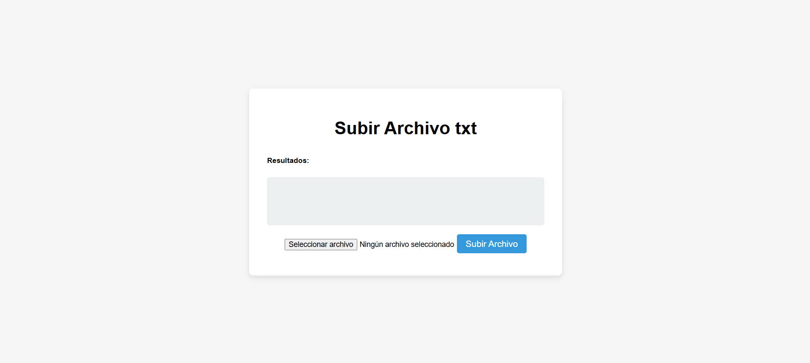
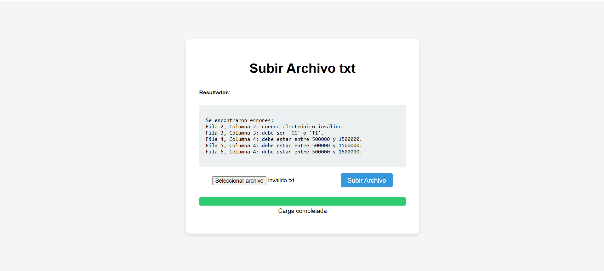
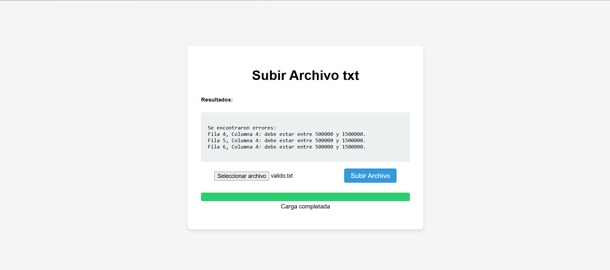
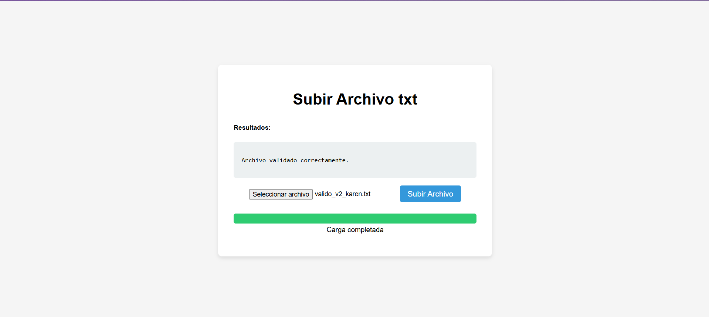
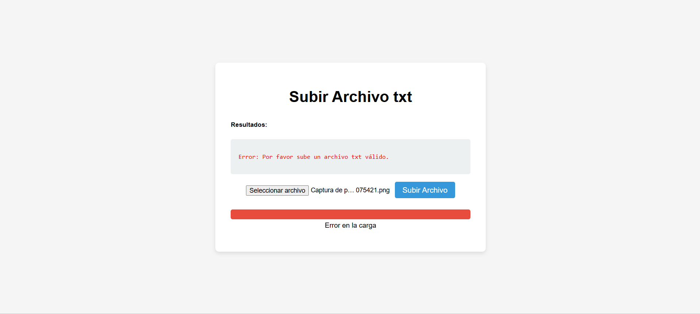

# Prueba técnica para desarrollador junior
- Este proyecto consiste en un desarrollo de software en Django que permita al usuario cargar un archivo txt.
- El objetivo es validar un archivo de acuerdo a los requisitos establecidos por la prueba.

## Requisitos de la prueba 
El archivo txt que se subirá debe cumplir con las siguientes condiciones:

1. El archivo solo debe permitir las 5 columnas, si existen más o menos deberá alertar al usuario
2. Columna 1: Solo debe permitir números enteros entre 3 y 10 caracteres 
3. Columna 2: Solo debe permitir correos electrónicos
4. Columna 3: Solo debe permitir los valores “CC” o “TI”
5. Columna 4: Solo debe permitir valores entre 500.000 y 1.500.000
6. Columna 5: Permite cualquier valor

### Funcionalidades

- **Carga de Archivos:** Los usuarios pueden cargar archivos TXT a través de un formulario en la interfaz web.
- **Validación de Datos:** Al cargar el archivo, la aplicación valida cada fila y columna según los criterios especificados.
- **Mensajes de Resultado:** La aplicación mostrará mensajes que indican si la validación fue exitosa o si se encontraron errores, incluyendo la fila y columna correspondiente a cada error.
- **Interfaz Amigable:** La interfaz está diseñada para ser intuitiva, facilitando la carga y la visualización de resultados.


## Prerequisitos
*Antes de comenzar, es ncesario tener instalado:*

- Python (versión 3.12.9)
- pip (gestor de paquetes de Python)
- Virtualenv (opcional, pero recomendado para crear entornos virtuales)

## Instalación
Para instalar y ejecutar el proyecto en su máquina local:

### Clonar el Repositorio
Primero, clona el repositorio de Git a tu máquina local utilizando el siguiente comando:

```
git clone https://github.com/Karen-Lara98/prueba_adres_1.git
```

### Crear y Activar un Entorno Virtual (Opcional)
* Es recomendable utilizar un entorno virtual para mantener las dependencias del proyecto separadas y organizadas.

* Para crear y activar un entorno virtual, ejecuta:

### En Windows

```
python -m venv venv
venv\Scripts\activate
```

### En Unix o MacOS
```
python3 -m venv venv
source venv/bin/activate
```

### Instalar Dependencias
Instala todas las dependencias requeridas para el proyecto ejecutando:
```
pip install -r requirements.txt
```


### Ejecutar el Servidor de Desarrollo
Finalmente, inicia el servidor de desarrollo con:
```
python manage.py runserver
```

Por ultimo dirijase en el navegador *(el de su preferencia)* a la siguiente dirección que es en donde el servidor:
```
http://127.0.0.0.1:8000
```
### Ejemplos de funcionalidad

- Página inicial



- Validación con archivo _(invalido.txt)_



- Validación con archivo _(valido.txt)_



Acá se puede apreciar que a pesar de que es el archivo denominado "valido" también contiene errores.

- Validación con archivo _(valido_v2_karen.txt)_



En este caso lo que hice es proponer un archivo el cual NO contiene errores, la única modificación que hice fue corregir los valores del anterior archivo para que si estuvieran dentro del rango permitido.

- Validación con archivo que NO es un TXT



Por último, quise validar que mi aplicación en caso de que se le pase una archivo que no es un TXT tuviera la capacidad de responder y controlar el error.